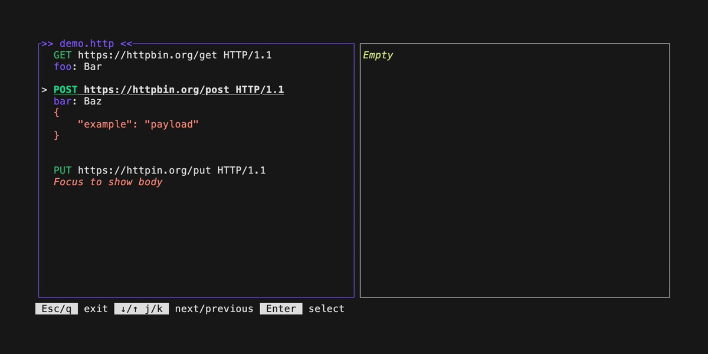

# rq
[](https://github.com/TheRealLorenz/rq/actions/workflows/rq-core.yml) [](https://github.com/TheRealLorenz/rq/actions/workflows/rq-cli.yml)


<p align="center"><em>demo generated with <a href="https://github.com/charmbracelet/vhs">vhs</a></em></p>

`rq` is an interactive HTTP client that parses and execute requests. It attempts to provide a minimal CLI 
alternative to [vscode-restclient](https://github.com/Huachao/vscode-restclient).
`rq` follows the standard [RFC 2616](https://www.w3.org/Protocols/rfc2616/rfc2616-sec5.html).

Original author blogpost: https://protiumx.github.io/blog/posts/an-http-request-parser-with-rust-and-pest-rs/

## Installation

```bash
cargo install --path rq-cli
```

## HTTP File

The `pest` grammar can be found [here](./rq-core/src/grammar.pest).
You can use the [pest editor](https://pest.rs/#editor) to try it out and check how it works.

### Explanation

```
-- request --
{request_line}\n
{header\n\n}*
{body\n}?
```

A `request` is conformed by: `{ request_line, headers, body}`, where `headers` and `body` are optional
matches.
- `request_line` is conformed by: `{ method, target, version }`.
  - `method` is one of `GET`, `POST`, `PUT`, `DELETE` (optional, defaults to `GET`).
  - `target` is the target url.
  - `version` is one of `HTTP/0.9`, `HTTP/1.0`, `HTTP/1.1`, `HTTP/2.0`, `HTTP/3.0` (optional, defaults to `HTTP/1.1`)
- `headers` is a collection of `header` `{ header_name, header_value }` (optional).
- `body` is anything that doesn't match headers and has a preceding line break, as specified in the RFC (optional).
